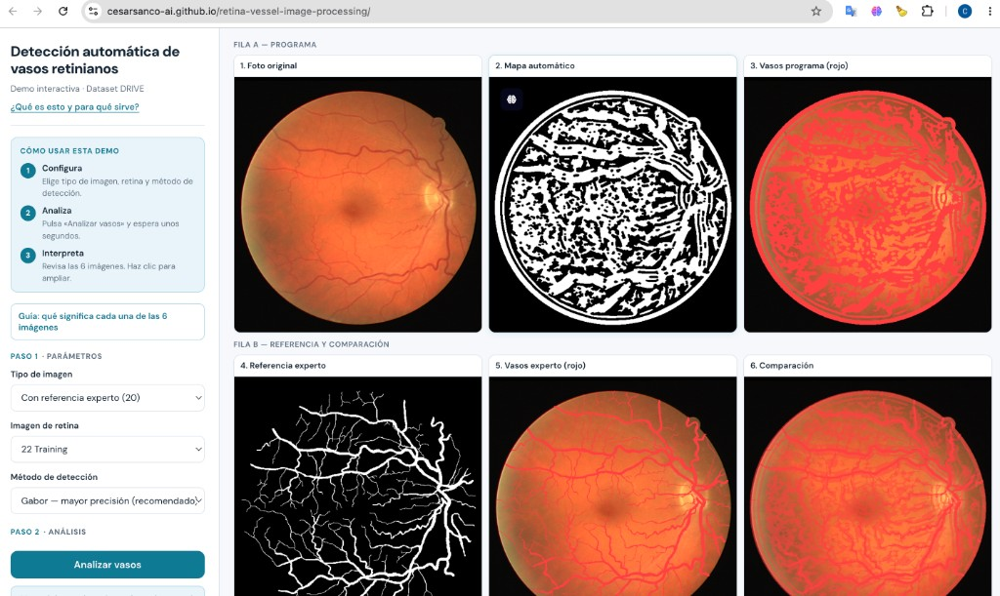

# Demo — Detección de vasos retinianos (DRIVE)

Demo interactiva que muestra cómo la **visión por computador** detecta vasos sanguíneos en retinografías del dataset [DRIVE](https://drive.grand-challenge.org/), con métodos clásicos de procesamiento de imagen (Frangi, Gabor).

**Autor:** [Carlos César Sánchez Coronel](https://github.com/cesarsanco-ai)

**Demo en vivo:** [cesarsanco-ai.github.io/retina-vessel-image-processing](https://cesarsanco-ai.github.io/retina-vessel-image-processing/)

---

## Vista previa

Captura de la demo desplegada (imagen 22 · Gabor · con referencia experto):

Abre el link para probarla: elige imagen y método, pulsa **Analizar vasos** y revisa las 6 imágenes numeradas.

---

## Contenido del repositorio

Solo la demo estática: `index.html`, `manifest.json` y PNG precalculados en `assets/`.

---

## Aviso

Demo de investigación y demostración técnica. **No diagnostica** ni sustituye evaluación clínica.

## Licencia

Código: [MIT](LICENSE). Imágenes DRIVE: [condiciones del dataset](https://drive.grand-challenge.org/).
